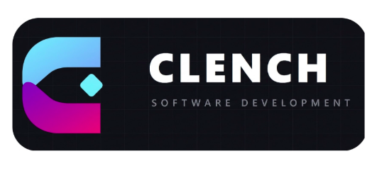

# MANUAL DE COORDINACIÓN Y PLAN DE DIRECCIÓN DEL PROYECTO

<p align="center">
  
</p>

> **Equipo de Trabajo:** **CLENCH Software Development**  
> **Asignaturas:** Dirección y Gestión de Proyectos (DGP) & Metodologías de Desarrollo Ágil (MDA)  
> **Titulación:** Grado en Ingeniería Informática — Escuela Técnica Superior de Ingenierías Informática y de Telecomunicación (ETSIIT)  
> **Universidad:** Universidad de Granada (UGR)  
> **Curso Académico:** 2026 / 2027  
> **Proyecto:** Sistema de Agenda y Asignación de Tareas Accesible (Proyecto AUTOVIDA — C.E.E. Fundación Purísima Concepción)  
> **Versión del Documento:** 2.0  
> **Fecha de Elaboración:** Octubre de 2026  

---

## Firma y Aceptación de los Miembros del Equipo (CLENCH)

*Este documento ha sido completado, consensuado y formalmente aprobado por todos los integrantes de **CLENCH Software Development**, quienes asumen el compromiso de cumplir con las normativas, roles, estándares y procesos descritos a continuación para el correcto desarrollo del proyecto.*

| Nombre y Apellidos | Rol Asignado (Fase Inicial) | Carácter del Rol | Asignatura(s) | 
| :--- | :--- | :---: | :---: |
| **Miguel Ángel Luque** | Coordinador | Rotativo | DGP / MDA |
| **Yeray Rodríguez Navas** | Gestor de Calidad | **Fijo** | DGP / MDA |
| **Julián Carrión Tovar** | Gestor de Usabilidad y Accesibilidad | **Fijo** | DGP / MDA |
| **Pablo Hernández Ibáñez** | Moderador | Rotativo | DGP / MDA |
| **Pablo de la Torre Roldán** | Catalogador | Rotativo | DGP / MDA |
| **José Rodríguez Fernández** | Presentador | Rotativo | DGP / MDA |

---

## 1. IMAGEN DE EMPRESA

### 1.1 Identidad Corporativa: CLENCH Software Development
El equipo de trabajo opera bajo la denominación social y marca corporativa **CLENCH Software Development**. La identidad de la empresa nace con una profunda vocación de **Aprendizaje-Servicio e impacto social**, orientada a diseñar soluciones tecnológicas accesibles, fiables y centradas en las personas.

<p align="center">
  
</p>

- **Nombre Comercial:** CLENCH Software Development.
- **Lema / Propósito:** *"Tecnología accesible para transformar vidas y potenciar la autonomía"*.
- **Misión:** Desarrollar software de alta calidad, intuitivo y universalmente accesible que elimine barreras cognitivas y motrices en la vida diaria de estudiantes con Necesidades Específicas de Apoyo Educativo (NEAE).
- **Visión:** Consolidar una metodología de trabajo colaborativo ágil, rigurosa y empática en ingeniería del software, referente en la aplicación práctica de normativas de accesibilidad universal (WCAG 2.1 AA) e inclusión sociolaboral.
- **Valores Corporativos:**
  1. **Accesibilidad Universal y Empatía:** El usuario final (alumnado del programa PTVAL y docentes del C.E.E. Purísima Concepción) es el centro de cada decisión de diseño.
  2. **Calidad y Rigor Técnico:** Compromiso con el código limpio, testing exhaustivo, análisis estático y cero tolerancia a defectos críticos.
  3. **Transparencia y Trabajo en Equipo:** Comunicación honesta, responsabilidad compartida y reparto equitativo del esfuerzo.
  4. **Compromiso Social:** Responsabilidad ética y respeto absoluto a la privacidad, dignidad y protección de datos del colectivo asistido.

---

## 2. METODOLOGÍA DE DESARROLLO Y CICLO DE VIDA

### 2.1 Enfoque Metodológico Ágil
Para desarrollar la aplicación utilizaremos **metodología ágil**, integrando los principios y ceremonias de **Scrum** complementados con un tablero visual **Kanban** para la gestión fluida del trabajo en progreso (WIP). Este marco ágil se acopla a las buenas prácticas de dirección, gestión de alcance, costes, riesgos y plazos de **DGP** y a las directrices docentes de **MDA**.

### 2.2 Ciclo de Vida por Iteraciones
El desarrollo se estructura en un modelo de **prototipado evolutivo iterativo**, articulado en cuatro hitos principales de entrega y una fase final de verificación global:

1. **Fase Inicial (Entrega de primeros documentos — 21/22 de octubre de 2026):**
   - Constitución formal del equipo, Manual de Coordinación y Plan de Dirección.
   - Entrevista de requisitos con el cliente (Colegio Purísima Concepción) y visita presencial al centro.
   - Definición de Personajes, Escenarios y Visión del Producto (MDA - P0 y P1).
   - Elaboración de la Propuesta Técnica preliminar, arquitectura software y estimación de costes.
   - Product Backlog inicial y Plan de Entregas (MDA - P2).
2. **Iteración 1 (22 de octubre – 11/12 de noviembre de 2026):**
   - Puesta en marcha del entorno de trabajo e integración de la arquitectura base en Flutter.
   - Módulo central de perfiles de usuario accesibles, autenticación adaptada y estructura básica de agenda.
   - Primer prototipo funcional desplegado y evaluación intermedia ante el profesorado.
3. **Iteración 2 (12 de noviembre – 2/3 de diciembre de 2026):**
   - Implementación de flujos de tareas escolares: reprografía asistida paso a paso, registro diario de comedor y dietas especiales, y guía de visitas.
   - Integración del temporizador visual accesible y adaptable.
   - Sesión de demostración funcional intermedia y feedback directo con el centro.
4. **Iteración 3 (3 de diciembre – 21 de diciembre de 2026):**
   - Módulo de tareas personales configurables y chat accesible tutor-estudiante.
   - Ajustes refinados de accesibilidad física y cognitiva (contrastes, áreas táctiles, lectores de pantalla).
   - Estabilización del código, cobertura de tests unitarios y de integración.
5. **Hardening y Verificación Global (Final de Iteración 3):**
   - Proceso de estabilización integral: auditoría de vulnerabilidades, revisión exhaustiva de políticas de datos (RGPD) y revisión final de aceptación por parte del cliente.
6. **Defensa Final del Proyecto (12 de enero de 2027):**
   - Exposición oral, presentación de resultados y demostración práctica del software ante el tribunal docente y clientes.

### 2.3 Eventos y Ceremonias Ágiles Adaptadas
- **Sprint Planning (Inicio de iteración):** Selección de historias del Product Backlog, estimación en horas reales y desglose en tareas técnicas en el tablero Kanban.
- **Seguimiento Semanal (Weekly Standup):**
  - Reunión semanal síncrona presencial durante las sesiones de prácticas con el profesor/tutor.
  - Sincronización asíncrona regular por Discord comunicando: tareas completadas, objetivos inmediatos y posibles dependencias o bloqueos.
- **Sprint Review & Demo (Final de iteración):** Demostración del incremento de software potencialmente desplegable para validar los requisitos con el profesor y el cliente.
- **Sprint Retrospective:** Análisis interno del rendimiento grupal, precisión de estimaciones y plan de acciones de mejora para la siguiente iteración.

---

## 3. RECURSOS SOFTWARE DE DESARROLLO

La aplicación se desarrollará principalmente en **Flutter**. Trabajaremos con el **IDE de Flutter** por las facilidades que nos brinda a la hora de hacer tests unitarios e interfaces personalizables en tiempo de ejecución.

### 3.1 Stack Tecnológico Principal
- **Framework Frontend:** **Flutter (Dart)**. Permite el desarrollo multiplataforma nativo a partir de un único código base, garantizando un rendimiento óptimo en las tabletas Android del centro escolar y acceso web para pantallas táctiles de aula.
- **Entorno de Desarrollo (IDE de Flutter):** **Visual Studio Code / Android Studio** configurado con el paquete oficial de herramientas de Flutter y Dart. Proporciona:
  - *Hot Reload* y *Hot Restart* para acelerar drásticamente el ciclo de diseño y personalización de interfaces en tiempo de ejecución.
  - *Flutter DevTools* para inspección profunda del árbol de widgets, perfiles de memoria y rendimiento.
  - Entorno integrado de ejecución y depuración de pruebas unitarias (*Flutter Test*).
- **Backend y API REST:** **Node.js con Express y TypeScript**, garantizando tipado estático seguro, arquitectura modular y alto rendimiento en peticiones I/O.
- **Capa de Persistencia y Base de Datos:** **PostgreSQL** mediante **Prisma ORM**, desplegado en contenedores Docker para reproducibilidad de entornos de desarrollo.
- **Servicio de Comunicación en Vivo:** **WebSockets / Socket.io** para soporte del chat interactivo tutor-estudiante y notificaciones de tareas en tiempo real.
- **Catálogo de Pictogramas:** **Portal ARASAAC** (licencia Creative Commons), fuente estandarizada oficial para comunicación aumentativa y adaptativa.
- **Diseño y Prototipado UX/UI:** **Figma / Penpot** para creación de wireframes interactivos y validación visual previa.

---

## 4. ORGANIZACIÓN DEL EQUIPO DE TRABAJO (ESTRUCTURA, NORMAS)

### 4.1 Estructura del Equipo y Asignación Nominal
El equipo de trabajo está compuesto por 6 integrantes. Se seguirá una división de roles entre los integrantes del equipo, rotando aquellos roles menos importantes en cada iteración para repartir dicha carga. La asignación inicial de roles del equipo es:

- **Pablo Hernández Ibáñez** — *Moderador*
- **Yeray Rodríguez Navas** — *Gestor de Calidad*
- **Pablo de la Torre Roldán** — *Catalogador*
- **José Rodríguez Fernández** — *Presentador*
- **Julián Carrión Tovar** — *Gestor de Usabilidad y Accesibilidad*
- **Miguel Ángel Luque** — *Coordinador*

### 4.2 Responsabilidades de Cada Rol
Cada rol tendrá las siguientes responsabilidades:

1. **Coordinador:**
   - Organiza el trabajo del equipo, distribuye tareas, controla los plazos y realiza el seguimiento general del proyecto.
   - Se encarga de avisar sobre las próximas entregas y de planificar el tiempo de trabajo correspondiente a cada iteración.
   - Actúa como portavoz de gestión ante el profesorado de prácticas y vigila el balance de carga horaria.
2. **Catalogador:**
   - Responsable de recopilar, analizar y clasificar la información generada por el grupo en las distintas tareas asociadas a las prácticas.
   - Se encarga de revisar y consolidar la información añadida a la documentación en cada iteración y, cuando sea posible, de revisar la documentación de la iteración anterior en coordinación con el Gestor de Calidad.
   - Custodia y organiza la totalidad de la documentación en el repositorio institucional (`docs/`) y coordina la publicación de actas de reunión.
3. **Moderador:**
   - Responsable de plantear y moderar los debates, así como de seleccionar las ideas y decisiones grupales.
   - En caso de indecisión, **tiene la última palabra tras consultar con el Gestor de Calidad sobre la opción más adecuada**.
   - Asimismo, se encarga de gestionar y documentar los cambios en los documentos de especificación.
4. **Presentador:**
   - Se encarga de realizar todas las comunicaciones con el cliente, así como de elaborar presentaciones que muestren el avance y los resultados del proyecto.
   - Prepara los resúmenes que se comunicarán al cliente o profesor y decide, junto con los roles pertinentes, qué contenidos y preguntas se expondrán en cada iteración.
5. **Gestor de la Calidad (Rol Fijo):**
   - Responsable de asegurar la calidad de los productos generados y del proceso de desarrollo. Vela por que la documentación y las técnicas aplicadas cumplan con los estándares definidos.
   - Asegurarse de que se usan herramientas estandarizadas para especificación y diseño (diagramas UML en Visual Paradigm y plantillas de ingeniería de software).
   - Asegurarse de que se organiza bien el trabajo: celebración regular de reuniones, toma de actas formales, reparto equitativo de tareas y uso de recursos hardware y software correctos.
   - Revisar o asegurarse de que se revisen o prueben todos los entregables (verificando correctitud y completitud) y de que se terminan a tiempo o se planifica adecuadamente cualquier cambio de fecha.
   - Supervisar los criterios de aceptación, revisiones de código, análisis estático continuo y auditorías periódicas de calidad del proceso y producto.
6. **Gestor de Usabilidad y Accesibilidad (Rol Fijo):**
   - Responsable de planificar, coordinar y velar por la usabilidad y la accesibilidad del proyecto. Se encarga de investigar e informar al equipo sobre las buenas prácticas, técnicas y herramientas a utilizar en estas materias.
   - Define los requisitos de accesibilidad, formula las preguntas necesarias de las consultas que se harán y verifica su correcto cumplimiento mediante pruebas de usuario, testing o entrevistas. Para el desarrollo e implementación de estas actividades contará con el apoyo de los roles correspondientes.
   - Formarse y formar a sus compañeros en guías de usabilidad y accesibilidad web y móvil (WCAG 2.1 AA, heurísticas de accesibilidad cognitiva y diseño accesible).
   - Aplicar lectores de pantalla (TalkBack en Android, VoiceOver en iOS) y validadores de accesibilidad (Lighthouse, WAVE, Google Accessibility Scanner).
   - Elaborar informes periódicos del progreso del trabajo en cuanto a usabilidad y accesibilidad.

### 4.3 Fijeza, Rotación de Roles y Protocolo de Ausencias
- **Roles Fijos:** Los roles de **Gestor de Calidad** y **Gestor de Usabilidad y Accesibilidad** serán **fijos** a sus responsables correspondientes (Yeray Rodríguez Navas y Julián Carrión Tovar, respectivamente) durante todo el proyecto para garantizar la especialización técnica continua y el rigor metodológico.
- **Roles Rotativos:** El resto de integrantes rotará de rol en cada iteración de trabajo según el ciclo formal predefinido:
  $$\dots \longrightarrow \text{Coordinador} \longrightarrow \text{Catalogador} \longrightarrow \text{Moderador} \longrightarrow \text{Presentador} \longrightarrow \dots$$
- **Protocolo de Ausencias y Sustituciones:**
  - En caso de que algún integrante con cualquiera de los roles de Gestor (Calidad o Accesibilidad) no pueda acudir a una iteración de trabajo, dicho rol será cedido temporalmente al que en dicha iteración ejerza el rol de **Coordinador** (y al **Presentador** en caso de inasistencia de ambos).
  - Si algún rol rotativo no está presente en una iteración, se le cederá durante esa iteración al responsable de ese rol en la siguiente iteración.

### 4.4 Matriz de Rotación de Roles por Iteración

| Integrante | Rol Inicial | Fase Inicial | Iteración 1 | Iteración 2 | Iteración 3 |
| :--- | :---: | :---: | :---: | :---: | :---: |
| **Miguel Ángel Luque** | Coordinador | **Coordinador** | Catalogador | Moderador | Presentador |
| **Pablo de la Torre Roldán** | Catalogador | **Catalogador** | Moderador | Presentador | Coordinador |
| **Pablo Hernández Ibáñez** | Moderador | **Moderador** | Presentador | Coordinador | Catalogador |
| **José Rodríguez Fernández** | Presentador | **Presentador** | Coordinador | Catalogador | Moderador |
| **Yeray Rodríguez Navas** | Gestor Calidad | **Gestor Calidad (Fijo)** | **Gestor Calidad (Fijo)** | **Gestor Calidad (Fijo)** | **Gestor Calidad (Fijo)** |
| **Julián Carrión Tovar** | Gestor Accesibilidad | **Gestor Accesib. (Fijo)** | **Gestor Accesib. (Fijo)** | **Gestor Accesib. (Fijo)** | **Gestor Accesib. (Fijo)** |

*Nota: Esta matriz garantiza que los cuatro integrantes sujetos a rotación asuman exactamente una vez cada rol rotativo a lo largo de las cuatro fases del proyecto, combinando las labores de gestión con el desarrollo técnico de Frontend, Backend y Pruebas.*

---

## 5. HERRAMIENTAS PARA COMUNICACIONES EN EL EQUIPO DE TRABAJO Y REUNIONES

### 5.1 Canales de Comunicación
- **WhatsApp:** Canal principal para la organización operativa, concreción rápida de fechas y horarios de reuniones, y avisos urgentes o imprevistos de última hora.
- **Discord:** Plataforma oficial para realizar videollamadas grupales cuando no sea posible realizar reuniones presenciales, compartir pantalla durante sesiones de programación en pareja (*pair programming*) y mantener canales temáticos organizados (`#general`, `#desarrollo-front`, `#desarrollo-back`, `#calidad-accesibilidad`, `#gestion-dgp`).
- **ClickUp:** Herramienta centralizada para el seguimiento y control de las tareas en progreso, gestión del Product Backlog, diagramas de Gantt interactivos y agendas de trabajo.
- **Correo Institucional (@correo.ugr.es):** Medio formal reservado para comunicaciones institucionales con el profesorado y la dirección del centro cliente.

### 5.2 Protocolo de Reuniones y Actas
- **Reuniones Semanales con el Cliente / Profesor:** Se mantendrán reuniones semanales de seguimiento técnico y metodológico en la franja lectiva de prácticas para revisar el estado del avance, resolver dudas y validar el rumbo de las funcionalidades.
- **Reuniones Internas del Equipo:** Sesión de trabajo semanal fijada por consenso (habitualmente lunes en horario de tarde), presencial o telemática vía Discord, para revisar el tablero de tareas y sincronizar entregables.
- **Elaboración y Custodia de Actas:**
  - Toda reunión formal requiere la elaboración de un acta siguiendo la plantilla oficial (`docs/plantillas/plantilla_acta_reunion.md`).
  - El Catalogador (con el soporte del Moderador) redactará el acta registrando: asistentes, orden del día, debates mantenidos, decisiones acordadas y compromisos con responsables y fechas límite.
  - El acta se publicará en el repositorio (`docs/reuniones/`) en un plazo improrrogable máximo de **24 horas** tras finalizar la reunión.

---

## 6. RELACIONES CON EL CLIENTE (ENTREVISTAS, REUNIONES, REVISIONES, ...)

### 6.1 Protocolo de Interacción y Entrevistas
- Se realizarán reuniones y revisiones semanales con el cliente/profesor para comprobar la evolución del proyecto, validar las funcionalidades desarrolladas y resolver posibles dudas.
- Además, se concertarán **entrevistas específicas** cuando sea necesario para concretar o modificar los requisitos de la aplicación, recabar opiniones de las personas tutoras o validar la pertinencia de los apoyos visuales.
- Los cambios y decisiones acordados en estas reuniones se registrarán sistemáticamente en acta y se volcarán al Product Backlog para mantener permanentemente actualizada la planificación y los requisitos del proyecto.

### 6.2 Interlocutores y Consideraciones Éticas
- **Interlocutores:** Profesionales y equipo docente del C.E.E. Fundación Purísima Concepción, estudiantes del aula PTVAL y profesorado evaluador de DGP y MDA.
- **Compromiso Ético y Protección de Datos:** Máxima rigurosidad con el RGPD. Cualquier dato o imagen de prueba será completamente ficticio o contará con autorización expresa del centro. Se mantendrá una actitud de absoluto respeto y empatía hacia los beneficiarios del software.

---

## 7. ESTÁNDARES DE DOCUMENTACIÓN

### 7.1 Documentación Textual en LaTeX a través de GitHub
Para la documentación textual y técnica, es decir, especificaciones, documentos de desarrollo, diseño y manuales que requieran redacción formal, utilizaremos **LaTeX** gestionado de forma centralizada y versionado a través de **GitHub**. Esta elección asegura un riguroso control de versiones mediante Git, homogeneidad tipográfica corporativa y generación determinista de documentos en formato PDF de alta calidad.

Para asegurar consistencia profesional en todos los documentos generados por el equipo, **cada documento seguirá rigurosamente la siguiente estructura normalizada:**
1. **Portada Institucional:**
   - Logotipo oficial de CLENCH Software Development y escudo corporativo de la Universidad de Granada.
   - Título formal del documento y subtítulo descriptivo del proyecto AUTOVIDA.
   - Datos académicos: Asignaturas (DGP/MDA), Grado en Ingeniería Informática, curso 2026/2027.
   - Metadatos: Versión del documento, fecha de última revisión y relación completa de autores y roles.
2. **Historial de Cambios y Control de Versiones:**
   - Tabla con columnas: Versión, Fecha, Autor(es), Resumen detallado de modificaciones y Estado de aprobación.
3. **Firma y Conformidad de los Integrantes:**
   - Tabla de aprobación y compromiso expreso de los miembros del equipo.
4. **Tabla de Contenidos (Índice General):**
   - Índice jerárquico paginado y generado automáticamente con numeración decimal.
5. **Introducción y Objetivos:**
   - Justificación del documento, ámbito de aplicación y contexto del proyecto.
6. **Cuerpo Central Específico:**
   - Secciones y subsecciones estructuradas mediante numeración estricta, tablas normalizadas, diagramas legibles y cajas de aviso destacadas.
7. **Conclusiones, Riesgos o Siguientes Pasos:**
   - Cierre analítico y recomendaciones operativas derivadas del contenido.
8. **Referencias y Anexos:**
   - Normativas consultadas, enlaces web y material complementario.

*Proceso de Versionado, Compilación y Custodia:* El código fuente `.tex` y todos los recursos asociados (figuras, imágenes y tablas) se mantendrán y versionarán en el repositorio Git de GitHub bajo la ruta `docs/`. Las modificaciones documentales se gestionarán mediante el flujo estándar de ramas y revisiones mediante *Pull Requests*, asegurando la aprobación del equipo. Los documentos finales se compilarán en formato PDF y se dispondrá adicionalmente de versiones en Markdown cuando sea conveniente para su consulta rápida en la propia plataforma de GitHub.

### 7.2 Documentación de Código (Doxygen)
Con respecto a la documentación de código, hemos optado por usar **Doxygen**, aplicando así un estándar sencillo y fácil de entender para el grupo y cualquiera que pueda heredar el código, además de permitir la generación de documentación de código de manera dinámica a partir de los propios comentarios en los fuentes.

### 7.3 Concreción del Diseño Software (UML y Visual Paradigm)
Para la concreción del diseño de nuestra solución software (base de datos relacional, definición de clases, modelos de dominio, diagramas de secuencia y casos de uso) utilizaremos el estándar **UML**. Para ello nos apoyaremos en la herramienta **Visual Paradigm**, por su capacidad demostrada de generar diagramas completos, estandarizados y exportables fácilmente.

---

## 8. ESTÁNDARES DE CÓDIGO

Utilizaremos la herramienta **Flutter** para la implementación del software. Se establecen los siguientes estándares obligatorios de código:

### 8.1 Convenciones de Nomenclatura y Lenguaje
- **Idioma del Código:** Los nombres de las variables, funciones, métodos, clases y archivos estarán escritos en **inglés** para mayor estandarización internacional.
- **Nomenclatura de Variables y Funciones:** Se utilizará la forma lower-case / `lowerCamelCase` (ejemplo: `studentName`, `taskCompletionStatus`, `loadUserProfile()`, `startVisualTimer()`).
- **Nomenclatura de Clases y Widgets:** Se utilizará `PascalCase` de acuerdo a las convenciones oficiales de Flutter y Dart (ejemplo: `TaskDetailScreen`, `PictogramPicker`, `StudentRepository`).
- **Constantes y Enumerados:** Se empleará `UPPER_SNAKE_CASE` o `lowerCamelCase` según recomienden las guías de estilo oficiales de Dart (`static const int MAX_ATTEMPTS = 3;`).

### 8.2 Comentarios y Documentación en Código
- Los comentarios de los scripts, funciones, clases y demás estructuras se pondrán al inicio del documento o del respectivo bloque de código para mayor legibilidad y orden, empleando la sintaxis compatible con Doxygen (`///` o bloques `/** ... */`).
- Todo bloque describirá de forma sintética: propósito de la función/widget, parámetros de entrada, valores de retorno y posibles excepciones.

### 8.3 Principios de Diseño y Buenas Prácticas
- **Clean Code & SOLID:** Funciones cortas con una sola responsabilidad, nombres auto-explicativos y minimización de efectos colaterales.
- **Desacoplamiento UI / Lógica:** Separación estricta entre widgets visuales y la lógica de negocio o persistencia mediante repositorios y gestores de estado.
- **Formateo Automático Obligatorio:** Ejecución de `dart format .` y resolución de advertencias de `flutter analyze` de forma previa a cualquier subida al repositorio.

---

## 9. PLAN DE GESTIÓN DE CAMBIOS

Ante cualquier cambio solicitado (por el cliente, por el profesorado o por necesidades técnicas sobrevenidas), se revisarán los requisitos afectados y se evaluará su impacto en la planificación, el diseño y el desarrollo de la aplicación. 

Una vez aprobado el cambio, se realizarán las modificaciones necesarias tanto en la aplicación como en la documentación y memoria del proyecto, manteniendo siempre actualizados los requisitos.

### 9.1 Flujo Formal de Gestión de Cambios
```text
  [Solicitud de Cambio (Cliente / Tutor / Equipo)]
                         │
                         ▼
        [Análisis Técnico y de Impacto]
  (Alcance, Horas de Dedicación, Cronograma, Costes, Accesibilidad)
                         │
                         ▼
   [Revisión del Coordinador y Gestor de Calidad]
                         │
        ┌────────────────┴────────────────┐
        ▼                                 ▼
   [Aprobado]                     [Rechazado / Pospuesto]
        │                                 │
        ▼                                 ▼
[Actualizar Backlog,              [Notificar al solicitante
 Cronograma y Docs]                y registrar justificación]
```

### 9.2 Comunicación y Preaviso de 3 Días
Si la aprobación de un cambio compromete las fechas de entrega, el alcance principal o las condiciones fijadas en el pliego técnico, el equipo se compromete a comunicarlo formalmente al profesorado con un mínimo de **3 días de antelación**, exponiendo la causa de la desviación y el plan de mitigación previsto.

---

## 10. CONTROL DE VERSIONES (MÉTODO Y HERRAMIENTAS)

Utilizaremos la herramienta **GitHub** para el control de versiones, actualizando el repositorio compartido en cada sesión de prácticas, llevando a cabo un control supervisado y documentado correctamente, especificando qué cambios se han llevado a cabo.

### 10.1 Método de Trabajo en el Repositorio
- **Supervisión Continua:** Cada miembro subirá sus avances con regularidad, asegurando que el repositorio compartido refleje de forma veraz el estado técnico al término de cada sesión de prácticas.
- **Validación Previa:** Queda prohibido subir código defectuoso que impida la compilación o rompa los tests automatizados. Cada integrante debe validar localmente su código (`flutter test`, `dart format`) antes de sincronizar.
- **Gestión de Ramas y Pull Requests:** Para desarrollos de nuevos módulos o refactorizaciones complejas se utilizarán ramas temáticas (`feature/`, `bugfix/`) que se integrarán en la rama de desarrollo mediante Pull Requests revisadas.

### 10.2 Convención de Mensajes de Commit
Se adoptará el estándar de **Conventional Commits**:
`<tipo>: <descripción en imperativo y en minúsculas>`

Tipos reconocidos:
- `feat:` Inclusión de una nueva funcionalidad.
- `fix:` Corrección de un fallo o error en el sistema.
- `docs:` Alteración exclusiva en documentación, actas o comentarios.
- `style:` Ajustes de formato o maquetación sin alteración lógica.
- `refactor:` Reestructuración de código que no altera el comportamiento.
- `test:` Inclusión o modificación de pruebas unitarias o de integración.
- `a11y:` Mejoras directas de accesibilidad, contrastes o compatibilidad con TalkBack.
- `chore:` Tareas rutinarias de configuración, dependencias o herramientas.

---

## 11. GESTIÓN DE CALIDAD Y ACCESIBILIDAD (DURANTE EL DESARROLLO Y AL FINAL, INCLUIR HERRAMIENTAS)

Se revisará completamente todo el desarrollo al final de cada iteración y se corregirán los aspectos necesarios para alcanzar nuestros objetivos, asegurando una detección temprana de errores y validación continua del trabajo entregado.

### 11.1 Procedimiento de Calidad en Cada Iteración
Por cada iteración seguiremos rigurosamente los siguientes pasos de control:
1. **Definición de criterios de aceptación:** Discutiremos sobre lo que se ha de realizar en la iteración y qué criterios seguimos para determinar si se ha completado correctamente (Definition of Ready y Definition of Done).
2. **Revisiones de código:** Se revisará el código obligatoriamente en busca de errores antes de añadirlo a la rama de desarrollo de la nueva iteración.
3. **Análisis Estático Continuo:** Escaneo automatizado del código fuente en cada ciclo para identificar vulnerabilidades, duplicidades y fallos de estilo.
4. **Pruebas Unitarias y de Integración:** Ejecución de pruebas automatizadas sobre los nuevos módulos desarrollados en la iteración correspondiente.
5. **Pruebas de Regresión Iterativas (Iteraciones 2 y 3):** Al finalizar la Iteración 2 e Iteración 3, se verifica que los nuevos cambios no hayan roto funcionalidades previamente entregadas en la iteración anterior.
6. **Demo y Validación de Iteración:** Al cierre de cada iteración se realiza una revisión funcional con el cliente para validar el trabajo entregado.

### 11.2 Proceso de Hardening y Verificación Global
Al terminar la tercera iteración, se llevará a cabo el **proceso de hardening y verificación global**, el cual constará de:
- Una revisión y validación integral por parte del cliente.
- Ejecución completa de baterías de pruebas extremas (*smoke tests*, estrés y regresión total).
- Auditoría final exhaustiva que revisará las políticas de datos (RGPD) y analizará las posibles vulnerabilidades de seguridad del sistema.

### 11.3 Cuadro Oficial de Herramientas de Calidad y Accesibilidad

| Fase / Ámbito | Herramienta | Aplicación en el Proyecto |
| :--- | :--- | :--- |
| **Control de Versiones & CI/CD** | **GitHub** | Gestión del repositorio, control de Pull Requests y ramas. |
| **Análisis Estático & Estilo** | **SonarCloud / ESLint** | Detección automática de bugs, vulnerabilidades y formato de código. |
| **Pruebas Unitarias & API** | **Jest** | Automatización de pruebas de lógica e integración de servicios. |
| **Accesibilidad & UX** | **Lighthouse / WAVE** | Evaluación de niveles de accesibilidad (contraste, etiquetas, lectura). |
| **Gestión de Tareas y Bugs** | **Jira** | Trazabilidad de requisitos, incidencias y feedback de las demos. |

---

## 12. PLAN DE MEDICIÓN DEL DESEMPEÑO, RECOMPENSAS Y CASTIGOS

### 12.1 Medición y Registro del Esfuerzo
- Cada integrante registrará rigurosamente su dedicación semanal en la plantilla oficial (`docs/plantillas/plantilla_registro_horas.md`), detallando horas invertidas en especificación, desarrollo, pruebas, reuniones y documentación.
- El Coordinador y el Gestor de Calidad supervisarán la homogeneidad de la dedicación para detectar y corregir desviaciones tempranamente.

### 12.2 Sistema de Recompensas y Reconocimiento
- **Reconocimiento Público Interno:** En la reunión de retrospectiva de cada iteración se dejará constancia en acta del agradecimiento y mención destacada al compañero o rol que haya realizado aportes extraordinarios de innovación, soporte o calidad técnica.
- **Prioridad en la Elección de Tareas y Módulos:** Aquellos miembros que hayan mantenido un rendimiento sobresaliente y hayan culminado sus entregables con anticipación tendrán prioridad al elegir los componentes técnicos de desarrollo en la iteración siguiente.
- **Distribución Equitativa del Éxito:** El propósito común es que el compromiso coordinado permita a la totalidad del equipo optar a la calificación máxima de matrícula de honor (10) en ambas asignaturas.

### 12.3 Régimen Sancionador Interno (Castigos y Penalizaciones)
Para preservar la equidad, el respeto mutuo y el compromiso con los resultados del proyecto, se establece un régimen disciplinario vinculante:
1. **Inasistencias a Reuniones:**
   - La falta no justificada a una reunión conllevará un aviso de advertencia interna.
   - Acumular **dos faltas injustificadas** a reuniones oficiales supondrá una amonestación formal en acta y se traducirá directamente en una penalización en la nota individual remitida a los profesores responsables en los informes de gestión.
2. **Incumplimiento de Plazos y Entregables:**
   - Si un miembro no entrega su tarea asignada en la fecha acordada sin causa justificada comunicada con al menos **48 horas de antelación**, el Coordinador y el Gestor de Calidad reasignarán la tarea de urgencia a otro integrante.
   - El trabajo no realizado será reflejado en el informe de seguimiento individual como incumplimiento grave, reduciendo la ponderación de la evaluación del implicado.
3. **Falta de Calidad Reiterada:**
   - La subida continuada de código que rompa la compilación o incumpla las normas estipuladas requerirá rehacer el módulo fuera del horario de prácticas sin cómputo de horas de exceso.
